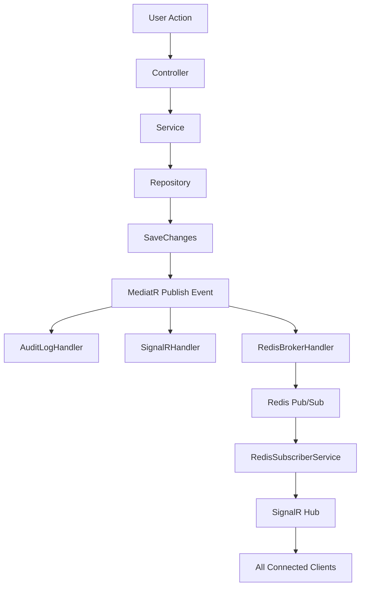

# 🌤️ WeatherForecast - Template ASP.NET Core Clean Architecture

Template complet d'application ASP.NET Core 9.0 avec Clean Architecture, démontrant les meilleures pratiques de développement moderne.

## 📋 Table des Matières

- [Vue d'Ensemble](#-vue-densemble)
- [Architecture](#-architecture)
- [Technologies](#-technologies)
- [Fonctionnalités](#-fonctionnalités)
- [Démarrage Rapide](#-démarrage-rapide)
- [Structure du Projet](#-structure-du-projet)
- [Patterns Implémentés](#-patterns-implémentés)
- [Documentation Détaillée](#-documentation-détaillée)

---

## 🎯 Vue d'Ensemble

Ce template démontre une architecture complète pour des applications ASP.NET Core modernes avec :

- **Clean Architecture** (Domain, Application, Infrastructure, API)
- **Domain Events** avec MediatR
- **Communication temps réel** via SignalR et Redis Pub/Sub
- **Authentification multi-niveaux** (JWT pour API, Identity pour Web)
- **Notifications temps réel** entre clients
- **Audit logs** automatiques
- **Rate limiting** et sécurité API

### 🎓 Cas d'Usage

Ce template est idéal pour :
- Apprendre les patterns modernes ASP.NET Core
- Démarrer un nouveau projet avec une base solide
- Comprendre l'architecture événementielle
- Implémenter des notifications temps réel
- Voir une séparation API/Web App fonctionnelle

---

## 🏗️ Architecture

### Diagramme de l'Architecture

```
┌─────────────────────────────────────────────────────────────┐
│                    CLIENTS WEB (Browsers)                    │
│                  SignalR WebSocket Connection                │
└───────────────────────────┬─────────────────────────────────┘
                            │
                            ▼
┌─────────────────────────────────────────────────────────────┐
│                  APPLICATION WEB (MVC)                       │
│  • Authentification Identity                                │
│  • Gestion des prévisions (CRUD)                            │
│  • SignalR Hub (notifications temps réel)                   │
│  • Redis Subscriber (écoute les events)                     │
└───────────────────────────┬─────────────────────────────────┘
                            │
                            ▼
┌─────────────────────────────────────────────────────────────┐
│                    REDIS PUB/SUB                             │
│  • Canal: weatherforecast.created                           │
│  • Canal: weatherforecast.updated                           │
│  • Canal: weatherforecast.deleted                           │
└───────────────────────────┬─────────────────────────────────┘
                            ▲
                            │
┌───────────────────────────┴─────────────────────────────────┐
│                      API REST                                │
│  • Authentification JWT + API Keys                          │
│  • Endpoints publics (lecture seule)                        │
│  • Rate Limiting (100 req/min)                              │
│  • Redis Publisher (publie les events)                      │
└───────────────────────────┬─────────────────────────────────┘
                            │
                            ▼
┌─────────────────────────────────────────────────────────────┐
│                   DOMAIN LAYER                               │
│  • Entities (WeatherForecast, User, Session, etc.)         │
│  • Domain Events (ForecastCreated, Updated, Deleted)        │
│  • Services (Business Logic)                                │
│  • Interfaces (Repositories, Services)                      │
└───────────────────────────┬─────────────────────────────────┘
                            │
                            ▼
┌─────────────────────────────────────────────────────────────┐
│                INFRASTRUCTURE LAYER                          │
│  • Repositories (EF Core)                                   │
│  • Unit of Work                                             │
│  • PostgreSQL Database                                      │
│  • Data Migrations                                          │
└─────────────────────────────────────────────────────────────┘
```

### Flux de Communication

#### Scénario : Création d'une Prévision

```
User (Browser 1) → Web App → Service → MediatR Event
                                          ↓
                                    Event Handlers:
                                    1. AuditLogHandler
                                    2. SignalRHandler (broadcast local)
                                    3. RedisBrokerHandler → Redis Pub
                                                              ↓
                                                        Redis Channel
                                                              ↓
                                          RedisSubscriber (Web App)
                                                              ↓
                                          SignalR Hub → All Clients
                                                              ↓
                                          User (Browser 2) ✅ Notification
```

---

## 🛠️ Technologies

### Backend
- **ASP.NET Core 8.0** - Framework web
- **Entity Framework Core 8.0** - ORM
- **PostgreSQL 16** - Base de données
- **Redis 7** - Pub/Sub et cache
- **MediatR** - Domain Events (CQRS pattern)
- **SignalR** - WebSocket temps réel
- **StackExchange.Redis** - Client Redis

### Frontend
- **Razor Pages / MVC** - Interface web
- **Bootstrap 5** - UI Framework
- **SignalR JavaScript Client** - Notifications temps réel

### Authentification & Sécurité
- **ASP.NET Core Identity** - Gestion utilisateurs (Web)
- **JWT Bearer** - Authentification API
- **API Keys** - Authentification externe (OAuth2 Client Credentials)
- **Rate Limiting** - Protection contre abus

### DevOps
- **Docker** - Containerisation
- **Docker Compose** - Orchestration locale

---

## ✨ Fonctionnalités

### 🔐 Authentification Multi-Niveaux

#### Application Web
- ✅ Inscription / Connexion avec Identity
- ✅ Gestion de sessions
- ✅ Cookies sécurisés
- ✅ Audit des connexions

#### API REST
- ✅ JWT Bearer pour authentification
- ✅ API Keys (OAuth2 Client Credentials)
- ✅ Rate Limiting (100 requêtes/minute)
- ✅ Swagger avec authentification

### 📡 Notifications Temps Réel

- ✅ **SignalR Hub** pour WebSocket
- ✅ **Redis Pub/Sub** pour communication inter-process
- ✅ **Notifications automatiques** lors de :
  - Création d'une prévision
  - Modification d'une prévision
  - Suppression d'une prévision
- ✅ **Synchronisation multi-clients** en temps réel

### 🎯 Domain Events (Event-Driven Architecture)

```csharp
// Création d'une prévision
await _service.CreateAsync(forecast);
    ↓
// MediatR publie automatiquement
await _publisher.Publish(new ForecastCreatedEvent(forecast));
    ↓
// Handlers s'exécutent en parallèle
1. AuditLogHandler → Enregistre dans la DB
2. SignalRHandler → Notifie les clients locaux
3. RedisBrokerHandler → Publie sur Redis
```

### 📊 Audit Logs

- ✅ Enregistrement automatique de toutes les actions
- ✅ Traçabilité complète (Qui ? Quoi ? Quand ?)
- ✅ Stockage en base de données

### 🔒 Sécurité

- ✅ **HTTPS** obligatoire
- ✅ **Data Protection** avec certificats
- ✅ **CORS** configuré
- ✅ **Anti-forgery tokens**
- ✅ **Rate limiting** sur API
- ✅ **Redis avec authentification**

---

## 🚀 Démarrage Rapide

### Prérequis

- ✅ [.NET 9.0 SDK](https://dotnet.microsoft.com/download/dotnet/9.0)
- ✅ [Docker Desktop](https://www.docker.com/products/docker-desktop)
- ✅ [Visual Studio 2022](https://visualstudio.microsoft.com/) (ou VS Code)
- ✅ [Git](https://git-scm.com/)

### Installation (5 minutes)

#### 1️⃣ Cloner le Repository

```bash
git clone <votre-repo>
cd test
```

#### 2️⃣ Démarrer PostgreSQL et Redis

**Windows (PowerShell)** :
```powershell
.\scripts\setup-database.ps1
```

**Linux/macOS (Bash)** :
```bash
chmod +x ./scripts/setup-database.sh
./scripts/setup-database.sh
```

Ce script va :
- ✅ Vérifier Docker
- ✅ Démarrer PostgreSQL (port 5432)
- ✅ Démarrer Redis (port 6379)
- ✅ Créer les migrations EF Core
- ✅ Initialiser la base de données

**Résultat attendu** :
```
========================================
  SETUP TERMINE AVEC SUCCES
========================================

[INFO] Base de donnees PostgreSQL prete:
   Host: localhost:5432
   Database: weatherforecastdb
   User: weatheruser

[INFO] Redis pret:
   Host: localhost:6379
   Password: redisSecurePass123!
```

#### 3️⃣ Configurer Visual Studio pour Démarrer les 2 Projets

1. **Clic droit sur la solution** → **Propriétés**
2. **Projets de démarrage** → Sélectionner **"Plusieurs projets de démarrage"**
3. Configurer :
   - **`api`** → Action : **Démarrer**
   - **`application`** → Action : **Démarrer**
4. **Appliquer** → **OK**


#### 4️⃣ Lancer l'Application

**Dans Visual Studio** :
- Appuyer sur **F5** (ou cliquer sur le bouton ▶️ Docker)

**Ou en ligne de commande** :

Terminal 1 (API) :
```bash
cd api
dotnet run
```

Terminal 2 (Web App) :
```bash
cd application
dotnet run
```

#### 5️⃣ Accéder aux Applications

| Application | URL | Description |
|------------|-----|-------------|
| **Web App** | https://localhost:7203 | Interface utilisateur principale |
| **API** | https://localhost:7252 | API REST publique |
| **Swagger** | https://localhost:7252/swagger/index.html | Documentation API interactive |

### 🎉 Premier Test

1. **Ouvrir 2 navigateurs** sur https://localhost:7203
2. **Créer un compte** sur chaque navigateur
3. **Navigateur 1** : Créer une prévision météo
4. **Navigateur 2** : 🎊 **La prévision apparaît en temps réel !**

---

## 📁 Structure du Projet

```
test/
├── 📂 domain/                      # Couche Domain (Logique métier)
│   ├── Entities/                   # Entités du domaine
│   │   ├── WeatherForecast.cs      # Entité principale
│   │   ├── ApplicationUser.cs      # Utilisateur
│   │   ├── Session.cs              # Sessions utilisateur
│   │   └── AuditLog.cs             # Logs d'audit
│   ├── Events/                     # Domain Events
│   │   ├── ForecastCreatedEvent.cs
│   │   ├── ForecastUpdatedEvent.cs
│   │   └── ForecastDeletedEvent.cs
│   ├── Interfaces/                 # Contrats
│   │   ├── IUnitOfWork.cs
│   │   ├── Repositories/
│   │   └── Services/
│   └── Services/                   # Services métier
│       ├── WeatherForecastService.cs
│       ├── AuthService.cs
│       └── ApiKeyService.cs
│
├── 📂 infra/                       # Couche Infrastructure
│   ├── Data/
│   │   ├── AppDbContext.cs         # EF Core DbContext
│   │   ├── UnitOfWork.cs           # Pattern Unit of Work
│   │   └── Migrations/             # Migrations EF Core
│   └── Repositories/               # Implémentations repositories
│       ├── WeatherForecastRepository.cs
│       └── ApiKeyRepository.cs
│
├── 📂 application/                 # Application Web (MVC)
│   ├── Controllers/                # Contrôleurs MVC
│   │   ├── WeatherForecastController.cs
│   │   └── AccountController.cs
│   ├── Hubs/                       # SignalR Hubs
│   │   └── WeatherForecastHub.cs
│   ├── BackgroundServices/         # Services d'arrière-plan
│   │   └── RedisSubscriberService.cs  # Écoute Redis Pub/Sub
│   ├── Handlers/                   # MediatR Handlers
│   │   └── SignalRForecastNotificationHandler.cs
│   ├── Views/                      # Vues Razor
│   │   ├── WeatherForecast/
│   │   └── Account/
│   ├── wwwroot/                    # Fichiers statiques
│   │   └── js/
│   │       └── weatherforecast-realtime.js  # Client SignalR
│   ├── Program.cs                  # Point d'entrée
│   └── appsettings.json            # Configuration
│
├── 📂 api/                         # API REST Publique
│   ├── Controllers/                # Contrôleurs API
│   │   ├── WeatherForecastController.cs
│   │   └── AuthController.cs
│   ├── Handlers/                   # MediatR Handlers
│   │   ├── AuditLogHandler.cs      # Audit automatique
│   │   └── RedisBrokerHandler.cs   # Publication Redis
│   ├── Program.cs                  # Point d'entrée
│   └── appsettings.json            # Configuration
│
├── 📂 scripts/                     # Scripts utilitaires
│   ├── setup-database.ps1          # Setup Windows
│   └── setup-database.sh           # Setup Linux/macOS
│
├── 📂 docs/                        # Documentation
│   └── DOMAIN_EVENTS.md            # Documentation Domain Events
│
├── docker-compose.yml              # Production
├── docker-compose.dev.yml          # Développement (PostgreSQL + Redis)
├── .env                            # Variables d'environnement (dev)
├── .env.production                 # Variables d'environnement (prod)
└── README.md                       # Ce fichier
```

---

## 🎨 Patterns Implémentés

### 1. Clean Architecture (Hexagonal Architecture)

```
┌─────────────────────────────────────────┐
│           Presentation Layer            │
│      (API Controllers, MVC Views)       │
└───────────────┬─────────────────────────┘
                │
┌───────────────▼─────────────────────────┐
│          Application Layer              │
│    (Use Cases, MediatR Handlers)        │
└───────────────┬─────────────────────────┘
                │
┌───────────────▼─────────────────────────┐
│            Domain Layer                 │
│  (Entities, Domain Events, Services)    │  ← Cœur métier
└───────────────┬─────────────────────────┘
                │
┌───────────────▼─────────────────────────┐
│        Infrastructure Layer             │
│  (EF Core, Repositories, External APIs) │
└─────────────────────────────────────────┘
```

**Avantages** :
- ✅ Indépendance du framework
- ✅ Testabilité maximale
- ✅ Séparation des responsabilités
- ✅ Évolutivité

### 2. Repository Pattern + Unit of Work

```csharp
// Utilisation
using (var uow = _unitOfWork)
{
    var forecast = await uow.WeatherForecasts.GetByIdAsync(id);
    forecast.TemperatureC = 25;
    await uow.SaveChangesAsync(); // Transaction unique
}
```

**Avantages** :
- ✅ Abstraction de la couche de données
- ✅ Transactions cohérentes
- ✅ Facilite les tests (mocking)

### 3. Domain Events (Event-Driven Architecture)

```csharp
// Publication d'un event
await _publisher.Publish(new ForecastCreatedEvent(forecast));

// Handlers multiples s'exécutent automatiquement
public class AuditLogHandler : INotificationHandler<ForecastCreatedEvent>
public class SignalRHandler : INotificationHandler<ForecastCreatedEvent>
public class RedisBrokerHandler : INotificationHandler<ForecastCreatedEvent>
```

**Avantages** :
- ✅ Découplage des composants
- ✅ Extensibilité (ajouter des handlers sans modifier le code existant)
- ✅ Traçabilité des actions

### 4. CQRS (Command Query Responsibility Segregation)

Séparation lecture/écriture via MediatR :

```csharp
// Command (écriture)
public record CreateForecastCommand(WeatherForecast Forecast) : IRequest<WeatherForecast>;

// Query (lecture)
public record GetForecastQuery(int Id) : IRequest<WeatherForecast>;
```

### 5. Pub/Sub Pattern (Redis)

Communication inter-process asynchrone :

```
API (Publisher) → Redis Channel → Web App (Subscriber) → SignalR → Clients
```

---

## 📚 Documentation Détaillée

### Configuration

#### Variables d'Environnement

**`.env` (Développement)** :
```env
ASPNETCORE_ENVIRONMENT=Development
POSTGRES_DB=weatherforecastdb
POSTGRES_USER=weatheruser
POSTGRES_PASSWORD=weatherpass
REDIS_PASSWORD=redisSecurePass123!
```

#### Connection Strings

**`appsettings.json`** :
```json
{
  "ConnectionStrings": {
    "DefaultConnection": "Host=localhost;Database=weatherforecastdb;Username=weatheruser;Password=weatherpass",
    "Redis": "host.docker.internal:6379,password=redisSecurePass123!"
  }
}
```

**`appsettings.Development.json` (Docker) :
```json
{
  "ConnectionStrings": {
    "DefaultConnection": "Host=postgres;Database=weatherforecastdb;Username=weatheruser;Password=weatherpass",
    "Redis": "redis:6379,password=redisSecurePass123!"
  }
}
```

### Endpoints API

#### Authentification

```http
POST /api/auth/register
POST /api/auth/login
POST /api/auth/refresh
POST /api/auth/logout
```

#### Prévisions Météo (Lecture seule - API Key requise)

```http
GET /api/weatherforecast          # Liste toutes les prévisions
GET /api/weatherforecast/{id}     # Récupère une prévision
```

**Authentification API** :
```http
Authorization: Bearer <api-key>
```

### SignalR Events

Le hub SignalR émet les événements suivants :

```javascript
// Écouter les événements
connection.on("ForecastCreated", (forecast) => { ... });
connection.on("ForecastUpdated", (forecast) => { ... });
connection.on("ForecastDeleted", (id) => { ... });
```

### Redis Channels

```
weatherforecast.created   → Nouvelle prévision créée
weatherforecast.updated   → Prévision mise à jour
weatherforecast.deleted   → Prévision supprimée
```

---

## 🧪 Tests

### Tester les Notifications Temps Réel

1. Ouvrir **2 navigateurs** sur https://localhost:7203
2. Se connecter avec **2 comptes différents**
3. **Navigateur 1** : Créer/Modifier/Supprimer une prévision
4. **Navigateur 2** : Observer la mise à jour en temps réel ✅

### Tester l'API avec Swagger

1. Ouvrir https://localhost:7252/swagger
2. Cliquer sur **"Authorize"**
3. Entrer une API Key (créée depuis l'interface Web)
4. Tester les endpoints GET

### Tester Redis Pub/Sub

```bash
# Se connecter au container Redis
docker exec -it weatherforecast-redis redis-cli -a redisSecurePass123!

# Écouter un canal
SUBSCRIBE weatherforecast.created

# Dans un autre terminal, créer une prévision via l'interface Web
# → Le message apparaît dans le terminal Redis ✅
```

---

## 🐛 Dépannage

### PostgreSQL ne démarre pas

```bash
# Vérifier les logs
docker logs weatherforecast-db

# Redémarrer
docker-compose -f docker-compose.dev.yml restart postgres
```

### Redis ne se connecte pas

**Erreur** : `Cannot write DateTime with Kind=Unspecified`

**Solution** : Déjà corrigée dans `Program.cs` :
```csharp
AppContext.SetSwitch("Npgsql.EnableLegacyTimestampBehavior", true);
```

### SignalR ne reçoit pas les notifications

1. Vérifier que Redis est démarré :
```bash
docker ps | grep redis
```

2. Vérifier les logs de l'application Web :
```
✅ Connecté à Redis: host.docker.internal:6379
🔔 Redis Subscriber Service démarré
✅ Abonné aux canaux Redis
```

3. Vérifier la connexion SignalR dans la console du navigateur (F12) :
```
✅ Connecté au hub SignalR WeatherForecast
```

---

## 🎓 Concepts Avancés

### Domain Events Flow



### Avantages de cette Architecture

1. **Scalabilité** : API et Web App peuvent être déployés séparément
2. **Résilience** : Si Redis tombe, les applications continuent de fonctionner
3. **Temps réel** : Notifications instantanées via SignalR + Redis
4. **Audit** : Traçabilité complète de toutes les actions
5. **Sécurité** : Multi-niveaux (JWT, API Keys, Identity)
6. **Testabilité** : Chaque couche peut être testée indépendamment

---

## 📖 Ressources

### Documentation Officielle

- [ASP.NET Core](https://docs.microsoft.com/aspnet/core)
- [Entity Framework Core](https://docs.microsoft.com/ef/core)
- [SignalR](https://docs.microsoft.com/aspnet/core/signalr)
- [MediatR](https://github.com/jbogard/MediatR)
- [StackExchange.Redis](https://stackexchange.github.io/StackExchange.Redis/)

### Articles Recommandés

- [Clean Architecture](https://blog.cleancoder.com/uncle-bob/2012/08/13/the-clean-architecture.html)
- [Domain Events](https://docs.microsoft.com/dotnet/architecture/microservices/microservice-ddd-cqrs-patterns/domain-events-design-implementation)
- [CQRS Pattern](https://docs.microsoft.com/azure/architecture/patterns/cqrs)

---

## 📝 Licence

Ce projet est un template éducatif. Libre d'utilisation et de modification.

---

## 👨‍💻 Auteur

Template créé pour démontrer les meilleures pratiques ASP.NET Core 9.0.

---

## 🙏 Remerciements

- Microsoft pour ASP.NET Core
- Jimmy Bogard pour MediatR
- Stack Exchange pour StackExchange.Redis
- La communauté .NET

---

**Bon développement ! 🚀**